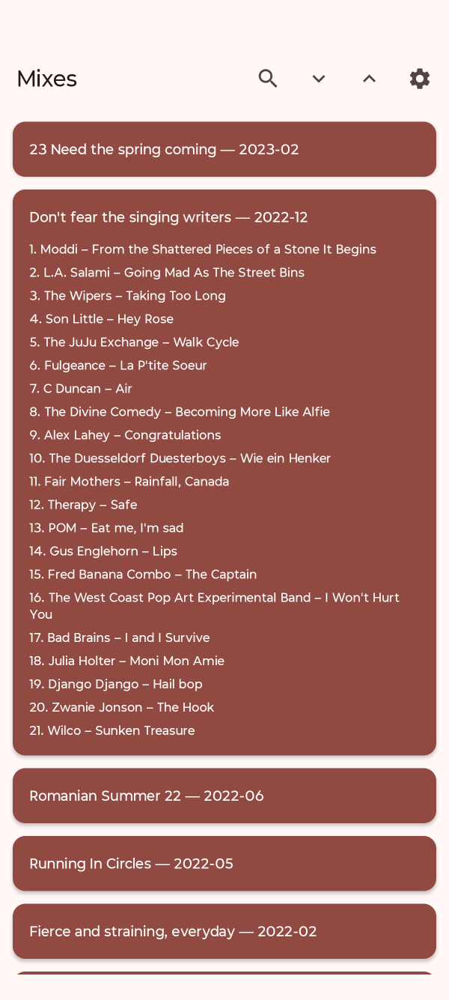
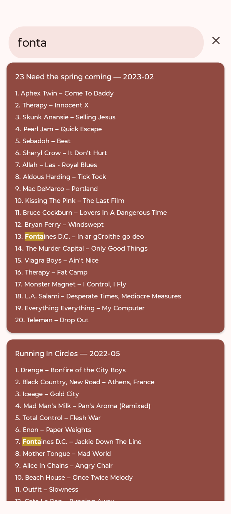

# About

This is an Android 15+ app that displays and allows to search in the playlists
of the music mixes I made for my car CD player. The mixes are written into a 
simple text file in cloud, and this app presents the contents prettier.

It has a settings screen that allows to enter the enter the share link of the 
file and download it.

## Screenshot of the app with one mix opened



## Screenshot of the app when searching



## URL of the mixes file

Create a public share of the mixes file and append `/download` on it, so that
the url you insert into the app might look like:

```
https://cloud.yourdomain.com/s/fowTxcQLSbagdxtrhjs/download
```

The app should run on *Android 15+* devices.


## File format

The mixes file in the cloud has this format:

```
2022-05 Running In Circles
    01. Drenge - Bonfire of the City Boys
    02. Black Country, New Road - Athens, France
    03. Iceage - Gold City
    04. Mad Man's Milk - Pan's Aroma (Remixed)
    05. Total Control - Flesh War
    06. Enon - Paper Weights
    07. Fontaines D.C. - Jackie Down The Line
    08. Mother Tongue - Mad World
    09. Alice In Chains - Angry Chair
    10. Beach House - Once Twice Melody
    11. Outfit - Slowness
    12. Cate Le Bon - Running Away
    13. Kit Sebastian - Affet Beni
    14. Joan As Police Woman - Holy City
    15. XTC - Generals And Majors
    16. The Dismemberment Plan - What Do You Want Me to Say
    17. Therapy - The Boy's Asleep
    18. PJ Harvey - Fountain

2022-02 Fierce and straining, everyday
 *  01. Charles Mingus - Haitian fight song
 *  02. Badbadnotgood - Beside April
 *  03. Captain Beefheart - Observatory Crest
 *  04. Voodoo Beach - Anders Sein
 *  05. Therapy - Perversonality
    06. Radiohead - Just
 *  07. Aufbruch - Ich bin so gluecklich
    08. Pankow - Werkstattsong
    09. New Model Army - Stupid Questions
    10. The Feelies - Crazy Rhythms
    11. Julia Holter - Everytime Boots
    12. Steve Lacy - Guide
    13. Queens Of The Stone Age - Born To Hula
    14. Drenge - Never See the Signs
    15. The Jesus Lizard - Trephination
    16. Squid - Narrator
```

The asterisks are used to mark tracks as favorites. This feature is parsed but
not yet used in the app.
